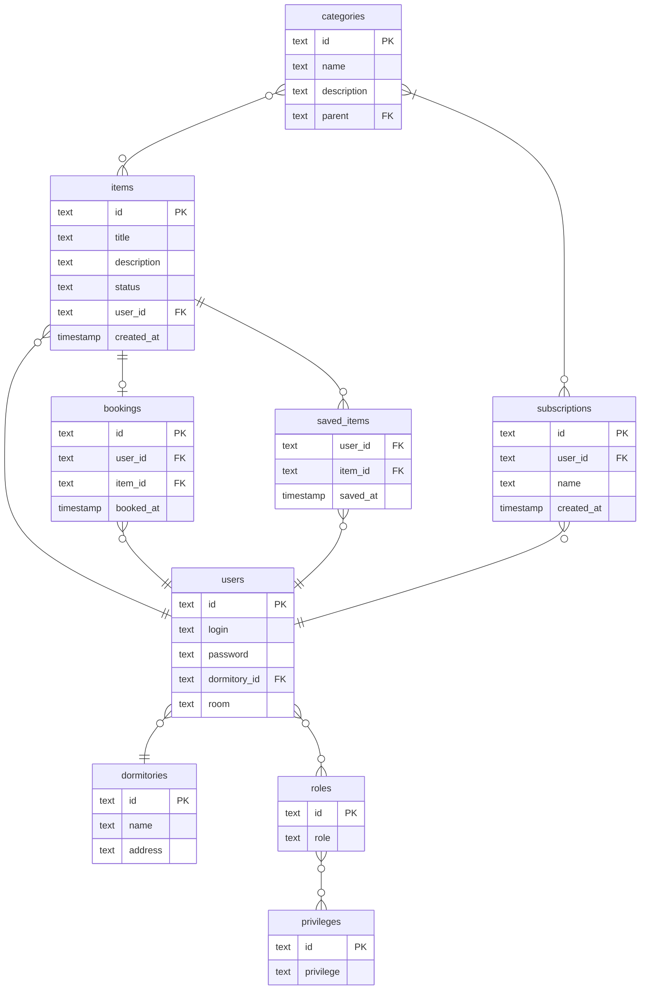

## Entity Relationship Diagram 

```mermaid
erDiagram
    dormitories {
        text id PK
        text name
        text address
    }
    users {
        text id PK
        text login
        text password
        text dormitory_id FK
        text room
    }
    roles {
        text id PK
        text role
    }
    privileges {
        text id PK
        text privilege
    }
    categories {
        text id PK
        text name
        text description
        text parent FK
    }
    items {
        text id PK
        text title
        text description
        text status
        text user_id FK
        timestamp created_at
    }
    bookings {
        text id PK
        text user_id FK
        text item_id FK
        timestamp booked_at
    }
    saved_items {
        text user_id FK
        text item_id FK
        timestamp saved_at
    }
    subscriptions {
        text id PK
        text user_id FK
        text name
        timestamp created_at
    }
    
    users }o--|| dormitories : ""
    users }o--o{ roles : ""
    roles }o--o{ privileges : ""
    items }o--|| users : ""
    categories }o--o{ items : ""
    bookings }o--|| users : ""
    items ||--o| bookings : ""
    saved_items }o--|| users : ""
    items ||--o{ saved_items : ""
    subscriptions }o--|| users : ""
    categories }|--o{ subscriptions : ""
```